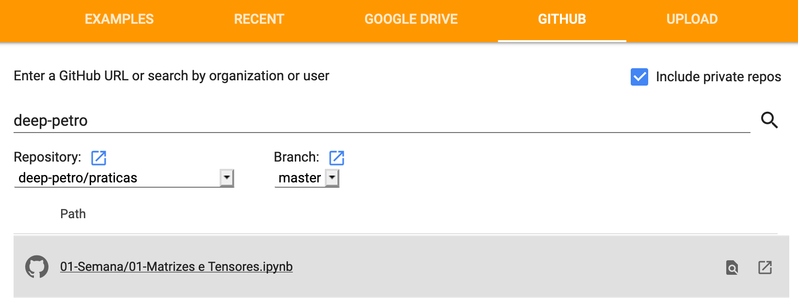

|-------------------------|---------------------------|----------------------------------|----------------------|
| [Logística](#logistica) | [Slides](#slides)         | [Calendário](#calendario)        |  [Executanto Notebooks](#collab) | [Apostilas em Notebook e Práticas](#projeto) |

# Aprendizado Profundo

Aprendizado  de  Máquina  compreende  uma  subárea  da  Inteligência  Artificial  na qual  a  modelagem  de  um  problema  e  suas  respectivas regras  e  hipóteses são aprendidas  de  forma  automática  a  partir  dos  dados  disponíveis.  Esse  tipo  de abordagem  tem  ganho  força  em  diversas  áreas  como  biologia,  neurociências, controle  de  tráfego,  indústria  automobilística  e,  mais  recentemente,  geociências. O objetivo do curso aqui descrito é na exploração de sub-área de aprendizado denominada de Aprendizado Profundo (Deep Learning).

<a name="logistica"/>

## Logística de Aulas 

**Sala 2008 - ICEX**

Esta disciplina será lecionada por 5 professores do DCC, cada um cuidando de 3 semanas seguidas de material: 
- Renato Assunção (redes neurais multi-camadas)
- Pedro Melo (redes convolucionais)
- Jefersson Santos (aplicações com imagens e visão computacional)
- Fabrício Murai (redes recorrentes)
- Flávio Figueiredo (Generative Adversarial Networks)

O curso inicia-se no dia 06 de agosto, terça-feira, e será encerrado no dia 14 de Novembro. Haverá um sábado letivo com prova no dia 24 de Agosto para repor a aula do feriado de 15 de Agosto. 

O curso terá uma primeira prova avaliando os pré-requisitos essenciais (ver abaixo os pré-requisitos). Esta prova será de múltipla escolha e aplicada no primeiro sábado, dia 10 de agosto, as 10 horas no ICEx. Esta primeira prova vale 10 pontos. Se você não conseguir ir bem nesta prova, aconselhamos fortemente que você tranque a disciplina imediatamente. No primeiro dia de aula, vamos liberar um exemplar do que será esta primeira prova.  

Haverá um conjunto de exercícios teóricos e práticos que devem ser entregues via moodle e que serão corrigidos de forma semi-automática valendo 15 pontos. 

Ao longo do curso teremos mais 5 provas, ao final de cada uma das 3 semanas de cada professor, cada uma delas valendo 15 pontos. A prova vai cobrar o domínio da teoria e do uso prático dos modelos de deep learning aprendido nos exercícios práticos.

Isto totaliza os 100 pontos da disciplina. 

Ao final do primeiro mês, os alunos interessados poderão submeter uma proposta de projeto prático em duas páginas. Apenas 10 projetos serão selecionados pelos professores para orientação personalizada até o final do semestre. O aluno deverá entregar um relatório final na forma de artigo científico. O projeto poderá ser feito em grupo de até 3 alunos. 
Este projeto-artigo valerá 10 pontos extra na nota apenas para os alunos de projetos selecionados. 

<a name="slides"/>

## Slides das aulas 

### Módulo 01 - Linear, Logística, Perceptron e Redes Neurais from Scratch 📈

1. [Motivação e Perceptron](https://homepages.dcc.ufmg.br/~assuncao/AAP/Sem%2001%20-%20Aula%2001.pdf)
1. [Logística from Scratch](https://homepages.dcc.ufmg.br/~assuncao/AAP/Sem%2001%20-%20Aula%2002.pdf)
1. [Verossimilhança e Perda](https://homepages.dcc.ufmg.br/~assuncao/AAP/Sem%2001%20-%20Aula%2003.pdf)
1. [Backpropagation from Scratch](https://homepages.dcc.ufmg.br/~assuncao/AAP/Sem%2002%20-%20Aula%2001.pdf)

### Módulo 02 - Aprendendo a Aprender. Algoritmos de Otimização e Regularização 🧠

1. [Grafos Computacionais](https://drive.google.com/open?id=10FlYMX6exbAYVpiD29U_OycfTE6SP2OyxncG8WGgrKY)
1. [Funções de Ativação e Generalização](https://homepages.dcc.ufmg.br/~assuncao/AAP/Sem%2002%20-%20Aula%2002.pdf)
1. [Otimização - Parte 01](https://homepages.dcc.ufmg.br/~assuncao/AAP/Sem%2002%20-%20Aula%2003.pdf)
1. [Otimização - Parte 02](https://homepages.dcc.ufmg.br/~assuncao/AAP/Sem%2002%20-%20Aula%2004.pdf)


### Módulo 03 - Aritmética e Redes Convolucionais 🌀

1. [CNNs Introdução e Histórico](https://docs.google.com/presentation/d/1liI-SMuHKs4jEyKhR9VCL4VtQ_cWPch25U3pw9RPjT8/edit?usp=sharing)
1. [CNNs Convoluções](https://docs.google.com/presentation/d/1ufxzsYkIMO6bmtxJeNnwKeO4PHEJC70oZ9W7anrOV4Q/edit?usp=sharing)

### Módulo 04 - Aplicações de CNNs. Visão e Autoencoders 👀

### Módulo 05 - Redes recorrentes e aprendizado com texto/sequências 🏃

### Módulo 06 - Redes Adversárias Generativas e DL-Research 🎨

### Listas e Site Antigo

[Nesta página estão os slides e listas de exercícios teóricos](https://homepages.dcc.ufmg.br/~assuncao/AAP/)

## Calendário 

[Calendário de aulas e provas](https://docs.google.com/spreadsheets/d/1bcDCZrOcAZxdpUVX4386m_vTmEKDK2ojoZ73eRHSOqk/edit?usp=sharing)

<a name="collab"/>

## Usando o Collab 

Para realizar as tarefas práticas sugerimos fazer uso do collab. O mesmo permite conectar com o Github, executar notebooks e fazer uso de GPUs. Ao acessar o [Collab](https://colab.research.google.com/notebooks/welcome.ipynb#recent=true),
clique em Github. Após isto, coloque os dados do repositório como na figura abaixo.



Agora basta clicar em um notebook e executar as células! Muito do nosso material vai usar arcabouços como `mxnet`
e `pytorch`. Para instalar um pacote no colab use o pip. Por exemplo, o código abaixo instalar o mxnet.

```
!pip install mxnet-cu100==1.4.1
```

<a name="projeto"/>

## Apostilas em Notebook e Práticas

Siga o link para acessar nossas apostilas. Algumas serão entregues como tarefas práticas [Apostilas em Notebook e Práticas](https://github.com/deep-ufmg/praticas/).
